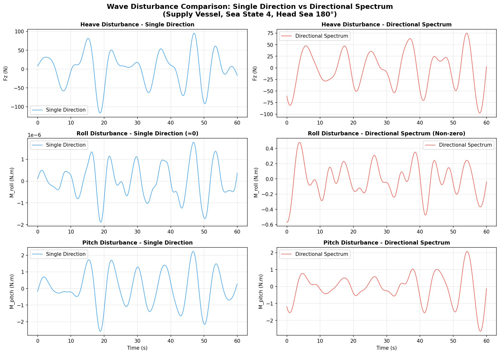
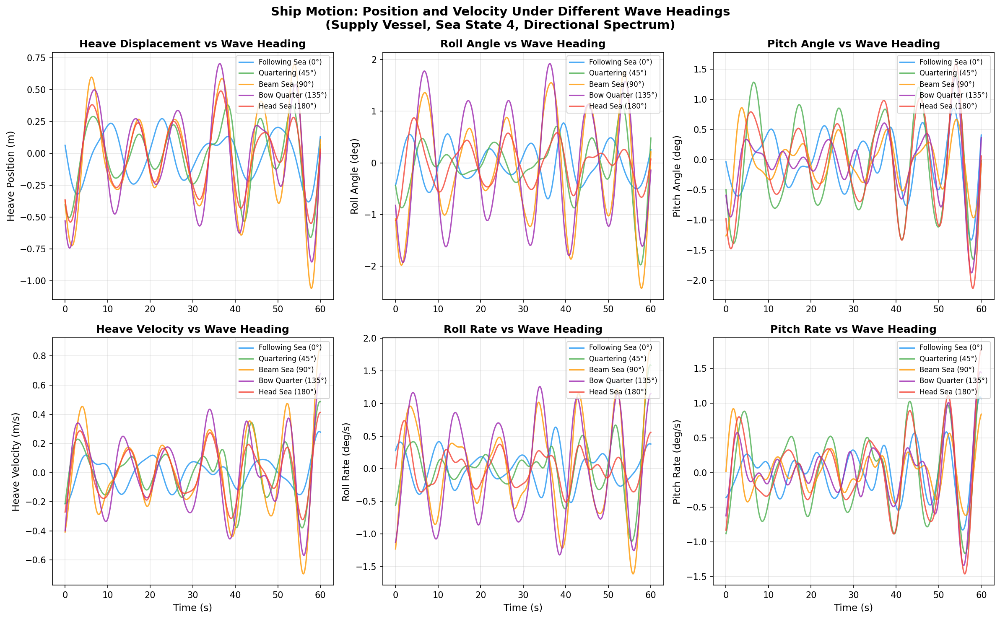
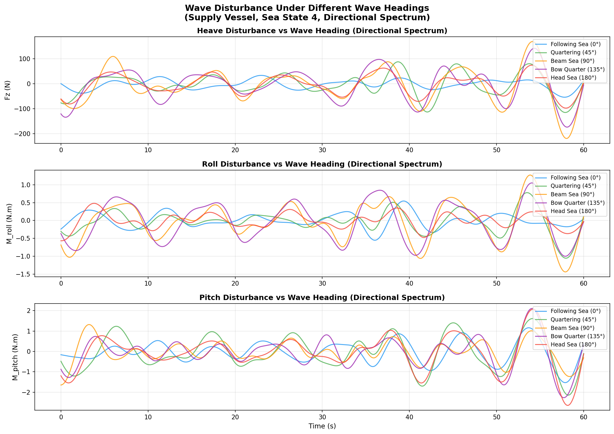

# Wave Disturbance Module

Ship wave disturbance calculation module based on MSS (Marine Systems Simulator) motion RAO data.

## Directory Structure

```
disturbance/
├── wave_disturbance.py         # Main disturbance model
├── load_mss_rao.py             # MSS RAO data loader
├── data/                       # MSS vessel data files
│   ├── supply.mat              # Supply vessel RAO
│   ├── s175.mat                # S175 container ship RAO
│   ├── tanker.mat              # Tanker RAO
│   ├── fpso.mat                # FPSO RAO
│   └── semisub.mat             # Semi-submersible RAO
├── docs/                       # Documentation
│   ├── wave_disturbance_summary.md    # Disturbance modeling method
│   ├── disturbance_comparison.md      # Method comparison
│   └── platform_params.md             # Platform parameters
└── figures/                    # Generated figures
    ├── ship_motion_PVA_english.png
    ├── wave_heading_comparison.png
    └── ...
```

## Quick Start

## UAV Landing / Impact Disturbance

This repo also includes a simple **UAV landing disturbance** model (static load + impulse) and a
ready-to-run demo to visualize the **platform states after impact**.

### UAV disturbance model

- Module: `simulation/disturbance/uav_landing_disturbance.py`
- Output generalized force (3DOF): `tau = [tau_z, tau_alpha, tau_beta]`
    - $+z$ is **gravity direction** (per project convention)
    - Static load is applied as a ramped step
    - Optional impact impulse is applied as a short half-sine pulse with
        $\int F_{imp}(t) dt = I_z$ (N·s)

Generated curve demo (disturbance only):

- Script: `simulation/common/plot_uav_landing_disturbance_demo.py`
- Output: `simulation/disturbance/figures/uav_landing_disturbance.png`

### Platform impact simulation demo (states after impact)

- Script: `simulation/disturbance/sim_platform_uav_impact_demo.py`
- It runs **two cases** for easy comparison:
    - `uav_only`: UAV disturbance only
    - `uav_plus_wave`: UAV disturbance + wave-induced ship motion

Outputs are generated under:

- `simulation/disturbance/figures/uav_impact/uav_only/`
- `simulation/disturbance/figures/uav_impact/uav_plus_wave/`

Each folder includes (z/alpha/beta stacked 3-subplots):

- `position.png`, `velocity.png`, `acceleration.png`
- `forces.png` (control / UAV disturbance / total)
- `disturbance.png`
- `*_zoom.png` (zoomed window around landing time $t_0$)

Key parameters to tune are near the top of the script:
- `UavLandingParams(t0, ramp, impulse_Iz, impulse_duration, radius_limit, ...)`
- simulation `dt` (smaller dt resolves the impulse shape better)

### Basic Usage (Single Direction)

```python
from simulation.disturbance.wave_disturbance import WaveDisturbance

# Create disturbance model
wave = WaveDisturbance(
    Hs=2.0,                    # Significant wave height (m)
    T1=8.0,                    # Mean period (s)
    vessel_file='supply.mat',  # Vessel RAO data
    wave_heading=180.0,        # Wave heading (deg), 180=head sea
    random_seed=42
)

# Generate disturbance
t = np.linspace(0, 100, 10000)
disturbance = wave.generate_disturbance(t)  # [Fz, M_alpha, M_beta]
```

### Advanced Usage (Directional Spectrum)

```python
# Create disturbance model with directional spectrum
wave = WaveDisturbance(
    Hs=2.0,
    T1=8.0,
    vessel_file='supply.mat',
    wave_heading=180.0,
    use_directional_spectrum=True,  # Enable directional spectrum
    n_directions=9,                 # Number of direction components
    spreading_exponent=2,           # cos^2s spreading (s=2)
    random_seed=42
)

disturbance = wave.generate_disturbance(t)
```

## Key Features

1. **Real Ship RAO Data**: Uses MSS (Fossen) vessel motion RAO
2. **Directional Spectrum**: Optional cos^2s spreading function
3. **Multiple Wave Headings**: Support for 0°-360° wave directions
4. **ITTC Spectrum**: Standard wave spectrum for ship hydrodynamics
5. **Physical Consistency**: Inertial force calculation F = m*a

## Directional Spectrum

### Why Use Directional Spectrum?

Real ocean waves have energy distributed over a range of directions, not just a single direction. The directional spectrum accounts for this spreading effect.

### Mathematical Model

**Directional Distribution Function:**
```
D(μ) = cos^2s(μ) / normalization
```
where:
- μ: Relative angle from main wave direction (range: -90° to +90°)
- s: Spreading exponent (typically 1-4, default: 2)
- Higher s → narrower spreading (more concentrated around main direction)

**Directional Spectrum:**
```
S(ω, μ) = S(ω) × D(μ)
```

### Key Finding: Roll Disturbance in Head Sea



**Critical Observation:**
- **Single Direction (180°)**: Roll disturbance ≈ 0 (due to ship symmetry)
- **Directional Spectrum**: Roll disturbance ≈ 0.23 N.m (non-zero due to energy spreading)

This explains the difference between simplified models and MATLAB MSS results!

### Quantitative Comparison

| Degree of Freedom | Single Direction | Directional (9 dirs) | Ratio |
|-------------------|------------------|---------------------|-------|
| **Heave** | 43.42 N | 39.51 N | 0.91× |
| **Roll** | **0.0000** N.m | **0.2038** N.m | **∞** |
| **Pitch** | 1.05 N.m | 0.85 N.m | 0.81× |

**Physical Explanation:**
Even when the main wave direction is 180° (head sea), the directional spectrum distributes energy to neighboring directions (170°, 190°, etc.). At these angles, the ship's Roll RAO is non-zero, resulting in a cumulative roll disturbance.

### When to Use Which Model?

| Use Case | Recommended Model | Reason |
|----------|------------------|--------|
| **Quick testing** | Single Direction | Fast computation, good for debugging |
| **Control design** | Directional (9 dirs) | More realistic, matches MATLAB MSS |
| **Final validation** | Directional (15+ dirs) | Highest accuracy |
| **Thesis publication** | Directional | Physical correctness |

### Implementation

```python
# Single direction (simplified)
wave = WaveDisturbance(
    Hs=2.0, T1=8.0,
    use_directional_spectrum=False
)

# Directional spectrum (recommended)
wave = WaveDisturbance(
    Hs=2.0, T1=8.0,
    use_directional_spectrum=True,
    n_directions=9,        # Number of discrete directions
    spreading_exponent=2   # cos^4(μ) distribution
)
```

**Recommended Settings:**
- `n_directions`: 9 (good balance of accuracy and speed)
- `spreading_exponent`: 2 (standard for open ocean)
- For higher accuracy: increase to 15-21 directions

## Parameters

### Sea States

| Sea State | Hs (m) | T1 (s) | Description |
|-----------|--------|--------|-------------|
| 3 | 1.0 | 6.0 | Rough |
| **4** | **2.0** | **8.0** | **Moderate** |
| 5 | 3.0 | 9.5 | Heavy |
| 6 | 4.0 | 11.0 | Very Heavy |

### Platform Parameters (Actual Size)

- Mass: 347.54 kg
- Ixx: 60.64 kg·m²
- Iyy: 115.4 kg·m²
- Size: ~1.16m diameter

## Multi-Heading Comparison

### Ship Motion (Position & Velocity)



### Ship Motion Statistics (Directional Spectrum, Sea State 4)

#### Position (Displacement & Angle)
| Wave Heading | Heave (m) | Roll (deg) | Pitch (deg) |
|--------------|-----------|------------|-------------|
| **Following Sea (0°)** | 0.168 | 0.345 | 0.444 |
| **Quartering (45°)** | 0.243 | 0.542 | 0.788 |
| **Beam Sea (90°)** | **0.385** | **1.008** | 0.385 |
| **Bow Quarter (135°)** | 0.368 | **1.098** | 0.518 |
| **Head Sea (180°)** | 0.256 | 0.394 | **0.766** |

#### Velocity (Linear & Angular Rate)
| Wave Heading | Heave Vel. (m/s) | Roll Rate (deg/s) | Pitch Rate (deg/s) |
|--------------|------------------|-------------------|-------------------|
| **Following Sea (0°)** | 0.094 | 0.248 | 0.339 |
| **Quartering (45°)** | 0.165 | 0.394 | 0.554 |
| **Beam Sea (90°)** | **0.270** | **0.688** | 0.296 |
| **Bow Quarter (135°)** | 0.246 | **0.728** | 0.424 |
| **Head Sea (180°)** | 0.161 | 0.259 | **0.547** |

### Disturbance Forces (Inertial)



| Wave Heading | Heave (N) | Roll (N.m) | Pitch (N.m) |
|--------------|-----------|------------|-------------|
| **Following Sea (0°)** | 18.4 | 0.194 | 0.53 |
| **Quartering (45°)** | 44.1 | 0.311 | 0.83 |
| **Beam Sea (90°)** | **69.9** | **0.541** | 0.52 |
| **Bow Quarter (135°)** | 64.4 | **0.541** | 0.73 |
| **Head Sea (180°)** | 39.5 | 0.204 | **0.85** |

### Key Observations

1. **Maximum Ship Motion**: Beam sea (90°) and bow quarter (135°) produce the largest roll angles (~1.0°)
2. **Maximum Velocities**: Beam sea produces highest roll rate (0.73°/s) and heave velocity (0.27 m/s)
3. **Head Sea Characteristics**: Maximum pitch angle (0.77°) and pitch rate (0.55°/s), but moderate roll
4. **Following Sea**: Minimum motion overall, suitable for control algorithm baseline testing
5. **Directional Spectrum Effect**: All headings show realistic non-zero roll motion, unlike single-direction simplification

## References

- Thor I. Fossen, "Handbook of Marine Craft Hydrodynamics and Motion Control", 2nd ed., Wiley, 2021
- MSS (Marine Systems Simulator): https://github.com/cybergalactic/FossenHandbook
